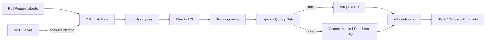

# 🛡️ AutoQA Guardian

Portão de qualidade com IA integrado ao CI/CD: a cada Pull Request, uma LLM analisa o diff, aponta riscos, gera testes para trechos sem cobertura e só libera o merge se os testes gerados passarem. Os resultados do pipeline ficam disponíveis via um servidor MCP, para consulta direta por um cliente como o Claude Desktop.

## Arquitetura



## Como funciona

1. **CI/CD (GitHub Actions)** — `.github/workflows/ai-qa-guardian.yml` dispara em todo `pull_request`.
2. **RAG** — `scripts/rag_context.py` busca, dentro dos testes já existentes no repositório, os trechos mais parecidos com o código alterado, para a IA seguir o estilo do projeto em vez de inventar do zero.
3. **LLM** — `scripts/analyze_pr.py` envia o diff do PR + o contexto do RAG para a API da Claude, recebe de volta um resumo de riscos e sugestões de teste, e grava um novo arquivo de teste.
4. **QA** — o workflow roda `pytest` sobre os testes gerados. Se falhar, o PR é bloqueado automaticamente.
5. **Automação (n8n)** — `n8n/README.md` descreve o fluxo que recebe o resultado do pipeline (sucesso ou falha) via webhook e decide a próxima ação (postar no Slack, abrir chamado, etc.).
6. **MCP** — `mcp_server/server.py` expõe uma ferramenta `get_pipeline_status` para qualquer cliente MCP consultar o histórico de execuções em linguagem natural.

## Setup

```bash
pip install -r requirements.txt
cp .env.example .env   # preencha ANTHROPIC_API_KEY
```

No repositório do GitHub, adicione o secret `ANTHROPIC_API_KEY` em **Settings → Secrets and variables → Actions**.

## Rodando localmente

```bash
python scripts/analyze_pr.py --diff caminho/para/diff.patch
pytest tests/
python mcp_server/server.py
```

## Roadmap

- [ ] Publicar resultado como comentário formatado no PR
- [ ] Métricas de cobertura antes/depois no comentário
- [ ] Suporte a múltiplas linguagens além de Python
